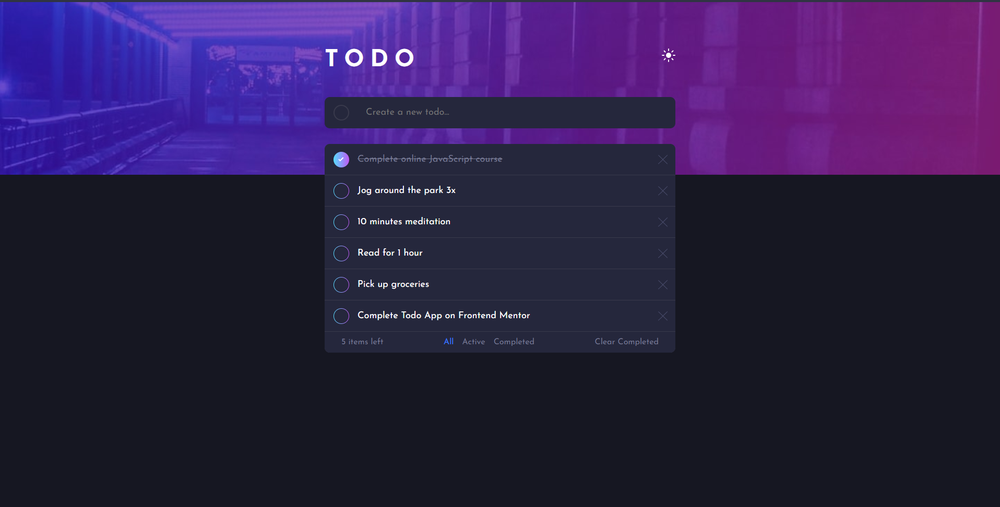

# ToDo App

## The challenge

Users should be able to:

- View the optimal layout for the app depending on their device's screen size
- See hover states for all interactive elements on the page
- Add new todos to the list
- Mark todos as complete
- Delete todos from the list
- Filter by all/active/complete todos
- Clear all completed todos
- Toggle light and dark mode

## Screenshot of the final solution

## Links

You can find my solution online at 

- Github pages [https://enzobocalon.github.io/frontend-ecommerce/]

## Tools

- React and CSS3

## Author

- Enzo Bocalon [https://github.com/enzobocalon]
